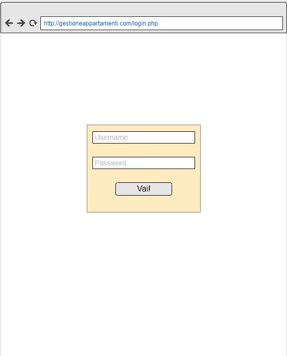

1. [Introduzione](#introduzione)
  - [Informazioni sul progetto](#informazioni-sul-progetto)
  - [Abstract](#abstract)
  - [Scopo](#scopo)
2. [Analisi](#analisi)
  - [Analisi del dominio](#analisi-del-dominio)
  - [Analisi dei mezzi](#analisi-dei-mezzi)
  - [Analisi e specifica dei requisiti](#analisi-e-specifica-dei-requisiti)
  - [Use case](#use-case)
  - [Pianificazione](#pianificazione)
3. [Progettazione](#progettazione)
  - [Design dell’architettura del sistema](#design-dell’architettura-del-sistema)
  - [Design dei dati e database](#design-dei-dati-e-database)
4. [Implementazione](#implementazione)
5. [Test](#test)
  - [Protocollo di test](#protocollo-di-test)
  - [Risultati test](#risultati-test)
  - [Mancanze/limitazioni conosciute](#mancanze/limitazioni-conosciute)
6. [Consuntivo](#consuntivo)
7. [Conclusioni](#conclusioni)
  - [Sviluppi futuri](#sviluppi-futuri)
  - [Considerazioni personali](#considerazioni-personali)
8. [Sitografia](#sitografia)
9. [Allegati](#allegati)


## Introduzione

### Informazioni sul progetto

 - **Progetto svolto da:** Gabriele Dominelli, Alessandro Spagnuolo
 - **Mandanti del progetto:** Massimo Sartori
 - **Docente Responsabile:** Massimo Sartori
 - **Scuola:** Arti e Mestieri Trevano
 - **Sezione:** Informatica
 - **Classe:** I3AA / I3BB
 - **Data d’inizio:** 16.03.2018
 - **Termine della consegna:** 18.05.2018


### Abstract

In this project our goal is to produce a web application, capable to handle flats and apartments reservation, here in Switzerland.

### Scopo

  Questo progetto consiste nell'implementazione di un'applicazione web che permetta di gestire l'affitto di appartamenti in Svizzera.


## Analisi

### Analisi del dominio

  Il progetto completo verrà presentato principalmente a un pubblico potenzialmente senza conoscenze informatiche. Le interfaccie e le funzionalità dovranno essere intuitive e seguiranno gli standard dei siti di fama più alta.

  
### Analisi e specifica dei requisiti

  Il committente richiede una struttura web che sia in grado di gestire l'affitto e la riservazioni di molti locali. Una volta che l'utente proprietario dell'appartamento le informazioni vengono salvate all'interno di un database. In un secondo momento altri utenti possono esplorare le specifiche dello spazio e procedere con un eventuale affitto o riservazione. 

  
|ID          |REQ-001                                         |
|------------|------------------------------------------------|
|**Nome**    |Pagina principale                               |
|**Priorità**|1                                               |
|**Versione**|1.0                                             |
|**Note**    |Pagina di default della struttura del sito.|
|**Sub-ID**  | Requisito                                      |
|**001**     | Sarà presente una descrizione del sito.                  |
|**002**     | Lista degli appartamenti, 6 per volta.              |
|**003**     | Pulsanti per login/iscrizione.              | 


|ID          |REQ-002                                         |
|------------|------------------------------------------------|
|**Nome**    |Filtri di ricerca                             |
|**Priorità**|1                                               |
|**Versione**|1.0                                             |
|**Note**    |Filtro di ricerca da applicare alla pagina principale.|
|**Sub-ID**  | Requisito                                      |
|**001**     | Filtro per “con o senza periodo”.                  |
|**002**     | Filtro per “numero di locali”.              |
|**003**     | Filtro per “Prezzo”.              | 


|ID          |REQ-003                                         |
|------------|------------------------------------------------|
|**Nome**    |Pagina di login                              |
|**Priorità**|1                                               |
|**Versione**|1.0                                             |
|**Note**    |Per utente già esistente.|
|**Sub-ID**  | Requisito                                      |
|**001**     | Accessibile dal pulsante della pagina principale “Accedi”.                  |
|**002**     | Campo di username e password.              |
|**003**     | Confermare l’accesso.              | 
|**004**     | Riporta alla pagina principale con l’utente desiderato.  |


|ID          |REQ-004                                         |
|------------|------------------------------------------------|
|**Nome**    |Pagina di registrazione                              |
|**Priorità**|1                                               |
|**Versione**|1.0                                             |
|**Note**    |Pagina per l’aggiunta di un nuovo appartamento.|
|**Sub-ID**  | Requisito                                      |
|**001**     | Accessibile dal pulsante della pagina principale “Registrati”. E dopo la creazione di un nuovo utente.|
|**002**     | Inserimento di username, password, nome, cognome, indirizzo, tel privato, tel ufficio ed email come campi obbligatori.|
|**003**     |Convalida dati.     | 
|**004**     | Controllo l’utente non sia già esistente. |                
|**005**     | Invio email con link di conferma.                   |
|**006**     | Riporta alla pagina di Login, per re-inserire le credenziali.             |


|ID          |REQ-005                                         |
|------------|------------------------------------------------|
|**Nome**    |Pagina creazione appartamento                               |
|**Priorità**|1                                               |
|**Versione**|1.0                                             |
|**Note**    |Pagina per l’aggiunta di un nuovo appartamento.|
|**Sub-ID**  | Requisito                                      |
|**001**     | È prima necessario essere un utente proprietario.                  |
|**002**     | Richiesta obbligatoria dei seguenti campi:
||	- Regione e Paese|
||	- Una o più foto|
||	- Pianta dell’appartamento.|
||	- Numero di locali|
||	- Posteggio (booleano + ev. quantità)|
||	- Prezzo (alta e bassa stagione, settimanale, mensile, annuale)|
||	- Spese|
||	- Accessori (lista)|
||	- Ammobiliato (booleano)|
||	- Fumatori (booleano)|
||	- Animali (booleano)|
||	- Bambini (booleano)|
||	- Ubicazione + carta|
||	- Disponibilità|
||	- Commenti|
|**003**     |Aggiunta automatica del nome, cognome, tel privato e email del proprietario.          | 
|**004**     | Salvataggio nel DB.  |


|ID          |REQ-006                                         |
|------------|------------------------------------------------|
|**Nome**    |Visualizzazione singolo appartamento                               |
|**Priorità**|1                                               |
|**Versione**|1.0                                             |
|**Note**    |Pagina che mostra le specifiche per ogni appartamento.|
|**Sub-ID**  | Requisito                                      |
|**001**     | Per utenti non registrati:|
|| - Visione di tutti i campi definiti nel REQ-005 tranne i contatti del proprietario.|
 
 
|ID          |REQ-007                                         |
|------------|------------------------------------------------|
|**Nome**    |Utente non registrato                               |
|**Priorità**|1                                               |
|**Versione**|1.0                                             |
|**Note**    |Specifiche di un utente non registrato.|
|**Sub-ID**  | Requisito                                      |
|**001**     | Può navigare liberamente per il sito senza però avere possibilità di richiedere di diventare proprietario di un appartamento e di visualizzare i contatti di un altro proprietario.|


|ID          |REQ-008                                         |
|------------|------------------------------------------------|
|**Nome**    |Utente registrato                           |
|**Priorità**|1                                               |
|**Versione**|1.0                                             |
|**Note**    |Specifiche di un utente registrato.|
|**Sub-ID**  | Requisito                                      |
|**001**     | Può navigare liberamente per il sito ed utilizzare tutti i servizi. Può richiedere di diventare un proprietario contattando un gestore.|
 

|ID          |REQ-009                                         |
|------------|------------------------------------------------|
|**Nome**    |Utente proprietario                               |
|**Priorità**|1                                               |
|**Versione**|1.0                                             |
|**Note**    |Specifiche di un utente proprietario.|
|**Sub-ID**  | Requisito                                      |
|**001**     | Può navigare liberamente per il sito ed utilizzare tutti i servizi. Può aggiungere un appartamento.                 |


|ID          |REQ-010                                         |
|------------|------------------------------------------------|
|**Nome**    |Utente gestore/amministratore                   |
|**Priorità**|1                                               |
|**Versione**|1.0                                             |
|**Note**    |Specifiche di un utente registrato.|
|**Sub-ID**  | Requisito                                      |
|**001**     | Naviga liberamente nel sito ed è un utente proprietario.        |
|**002**     | Gestisce gli utenti:
|| - Inserimento utenti|
|| - Modifica utenti|
|| - Cancellazioni utenti|
|| - Visualizzazione utenti|
 
 
|ID          |REQ-011                                         |
|------------|------------------------------------------------|
|**Nome**    |Creazione del DataBase                             |
|**Priorità**|1                                               |
|**Versione**|1.0                                             |
|**Note**    |Database contenente la lista di appartamenti.|
|**Sub-ID**  | Requisito                                      |
|**001**     | Creazione di uno schema ER.          |
|**002**     | Creazione di uno schema logico.    |
|**003**     | Contiene gli utenti non registrati, utenti registrati, utenti proprietari e gestori.      | 
|**004**     | Registra tutte le informazioni di ogni appartamento.  |

 


### Use case

Questo prodotto sarà un possibile candidato per la sostituzione di siti più conosciuti come immoscout.ch ed affini.

### Pianificazione

Questo é il Gantt che abbiamo realizzato in base alla lista dei requisiti che abbiamo redatto e al tempo a disposizione.


### Analisi dei mezzi
Come prodotti fisici abbiamo usato i seguenti:

| Proodotto | Caratteristiche |
|    :--    |    --:    |
|  PC portatile  |  Windows 10  |

| Pacchetto| Versione |
|    :--    |    --:    |
|  Apache  |   2.4.25 |
|  Php  |  7.0.19  |
|  MariaDB  |  10.1.23  |


### Analisi dei costi

#### Costo totale:
Non necessitando di mezzi specifici, gli unici costi sono quelli dei dipendenti.

|Costo per ora| Ore | Persone | Totale |
|----------------|----------------|----------------|----------------|
|60 fr.       |60|2|7200 fr.|


## Progettazione

### Design dei dati e database

Il database che abbiamo creato è abbastanza complesso, difatti abbiamo dovuto riguradare diversi aspetti prima di arrivare alla soluzione finale.

```sql

use efof_gestaff_2018;
create table if not EXISTS utente(
nome varchar(50) not null,
cognome varchar(50) not null,
username varchar(50), 
email varchar(50),
password varchar(50),
n_cellulare int not null,
n_ufficio int not null,
admin tinyint,
proprietario tinyint,
stato int,
primary key(username)
);
create table if not EXISTS appartamento(
id int primary key,
bambini tinyint,
fumatori tinyint,
piantina mediumblob,
animali tinyint,
titolo varchar(50),
regione varchar(50),
n_locali int,
posteggio tinyint,
paese varchar(50),
ammobiliato tinyint,
ubicazione varchar(50),
commenti text,
username_prop varchar(50),
foreign key(username_prop) references utente(username) on delete cascade on update cascade
);

create table if not EXISTS foto(
id int AUTO_INCREMENT PRIMARY KEY,
foto mediumblob,
id_appartamento int,
foreign key(id_appartamento) REFERENCES appartamento(id) on delete cascade on update cascade
);
create table if not EXISTS accessori(
nome varchar(30),
id_appartamento int,
primary key(nome, id_appartamento),
foreign key(id_appartamento) REFERENCES appartamento(id) on delete cascade on update cascade
);
create table if not EXISTS tipo(
tipo varchar(50) primary KEY
);
create table if not EXISTS prezzo(
prezzo int,
tipo varchar(50),
id_appartamento int,
foreign key(tipo) references tipo(tipo) on delete cascade on update cascade,
foreign key(id_appartamento) references appartamento(id) on delete cascade on update cascade,
primary key (prezzo, tipo, id_appartamento)
);
create table if not EXISTS spesa(
id int AUTO_INCREMENT PRIMARY KEY,
nome varchar(50),
prezzo int,
id_appartamento int,
foreign key(id_appartamento) references appartamento(id) on delete cascade on update cascade
);
create table if not EXISTS riserva(
data_inizio date,
data_fine date,
id_appartamento int,
username_utente varchar(50),
email_utente varchar(50),
password_utente varchar(50),
primary key(data_inizio, data_fine, id_appartamento, username_utente, email_utente, password_utente),
foreign key(id_appartamento) references appartamento(id) on delete cascade on update cascade,
foreign key(username_utente) references utente(username) on delete cascade on update cascade
);

 
```

### Schema E-R, schema logico e descrizione.

Questo é il diagramma ER del database generato per consentire lo scambio dei dati tramite le varie pagine web.


### Design delle interfacce

Qui di seguito sono riportate le progettazioni iniziali per tutte le pagine che abbiamo realizzato in questo progetto:
#### Pagina Principale


#### Pagina LogIn


#### Pagina Registrazione


#### Pagina Aggiunta appartamento


#### Pagina Visualizzazione appartamento


#### Pagina Gestione riservazioni


## Implementazione

### Supporto

Non è stato necessario l'utilizzo di nessun supporto in particolare. Essendo questo progetto prettamente legato al lato programmatorio, gli unici hardware sono stati i nostri pc portatili.

### Creazione pagina di registrazione

La pagina di registrazione è la pagina che permette agli utenti del sito web di registrarsi e di creare quindi il proprio account personale.
È composto da un form HTML contenente una tabella che a sua volta contiene vari tipi di input che in base al loro tipo vengono controllati con delle funzioni JavaScript, come ad esempio il campo di inserimento dell'email personale:
Questo è il codice per mostrare il campo di inserimento:

~~~html
<tr>
	<td valign="top">
	<label for="Email_Address"><span>Indirizzo email * </span></label>
	</td>
	<td valign="top">
		<input type="text" name="Email_Address" id="Email_Address" maxlength="100" style="width:230px" onchange="checkEmail()">
	</td>
</tr>
~~~~

Invece questo è il codice che controlla che l'email sia stata scritta correttamente:

~~~javascript
//funzione che controlla il contenuto dell'email immessa dall'utente
//tramite una regexp
function checkEmail(){
	email = document.getElementById('Email_Address').value;
	if(email == ""){
			alert("The email isn't correct");
			document.getElementById('Email_Address').value = "";
			return false;
	}
	else if (/^\w+([\.-]?\w+)*@\w+([\.-]?\w+)*(\.\w{2,3})+$/.test(email)){  
		return true;
	} 
	else{
		alert("The email isn't correct");
		document.getElementById('Email_Address').value = "";
		return false;
	} 
}
~~~

Semplicemente controlla con un'equazione regexp la correttezza dell'email.
In caso che manchino delle informazioni nel form, l'utente viene mandato ad una pagina che mostra un semplice testo che spiega all'utente che ci sono stati degli errori con la registrazione e viene quindi chiesto di tornare indietro a ricompilare il form.

Nel form c'è il bottone di submit che manda il contenuto del form tramite il metodo POST alla pagina php che prende i dati e li mette nel database e allo stesso tempo manda un'email all'utente interessato per permettere la registrazione totale del proprio account, dato che inizialmente il profilo viene inserito nel databse come utente non attivato quindi con stato = 0:

~~~php
//preparo la query che inserisce l'utente che si vuole registrare
$sql = "INSERT INTO utente VALUES ('$name', '$surname', '$username', '$email', '$password', '$tel_phone', '$tel_office', 0, 0, 0)";
//controllo che la query non dia errori
if ($conn->query($sql) === TRUE) {

}
//altrimenti stampo l'errore
else {
	echo "Error: " . $sql . "<br>" . $conn->error;
}
//chiudo la connessione
$conn->close();
~~~

Mentre questo è il codice che permette l'invio dell'email dove preparo il nome del mittente e il contenuto del testo:

~~~php
//preparo le variabili che servono a mandare l'email di conferma all'utente
$to = $email;
$subject = "Confirm registration";
$txt = 
  "Ciao ".$username."! Grazie per la registrazione!".
  " Clicca il link di seguito per completare la verifica del tuo account".
  "<br><a href='http://samtinfo.ch/gestaff/registrazione/email_verification.php?username=".$username."'>clicca qui</a>"
  ;
$headers =  'MIME-Version: 1.0' . "\r\n"; 
$headers .= 'From: WebMaster <webmaster@affitamenti.ch>' . "\r\n";
$headers .= 'Content-type: text/html; charset=iso-8859-1' . "\r\n"; 
//invio l'email
mail($to,$subject,$txt, $headers);
~~~

Dopodichè reindirizzo l'utente alla pagina principale del sito dove ha la possibilità di fare il suo login soltanto se ha attivato il suo account cliccando sul link inviato tramite l'email mandata precedentemente:

~~~php
 //reindirizzo l'utente alla pagina seguente
 header("Location: thankyou.htm");
~~~

La pagina thankyou.html mostra a schermo un ringraziamento per la registrazione e reindirizza l'utente alla pagina principale:

~~~javascript
function redirect(){
	setTimeout("window.location='http://samtinfo.ch/gestaff/index.php'",3000);
}
~~~

Dopo che l'utente ha cliccato il link mandato tramite email, che contiene nell'url l'username dell'account in questione, viene mandato alla pagina email_verification.php che si preoccupa di confermare l'account impostando sul database lo stato dell'utente interessato = 1 quindi attivato:

~~~php
//prendo l'username dell'utente che bisogna confermare dal get nell'url
if(isset($_GET['username'])){
	$u = $_GET['username'];
  //cambio lo stato di quell'utente da "non confermato" a "confermato"
	$sql = "update utente set stato = 1 where username = '".$u."'";
  //controllo che la query vada a buon fine
	if ($conn->query($sql) === TRUE) {

	} 
  //altrimenti stampo l'errore
	else {
		echo "Error: " . $sql . "<br>" . $conn->error;
	}
  //chiudo la connessione
	$conn->close();
}
~~~

Dopodichè l'utente viene reindirizzzato alla pagina principale in modo da rendere possibile il suo login:

~~~javascript
//funzione che reindirizza l'utente dopo 3 secondi alla pagina principale
function redirect(){
	setTimeout("window.location='http://samtinfo.ch/gestaff/index.php'",3000);
}
~~~

### Creazione pagina di login

La pagina di login ha un form HTML che contiene una tabella che a sua volta contiene due campi di inserimento: uno per l'username e uno per la password. Al di sotto di questi campi c'è il bottone di submit che manda tramite il metodo POST le informazioni dell'utente che vuole fare il login.

~~~html
<tr>
	<td valign="top">
	<label for="Username"><span>Username * </span></label>
	</td>
	<td valign="top">
	<input type="text" name="Username" id="Username" maxlength="80" style="width:230px">
	</td>
</tr>
<tr>
	<td valign="top">
	<label for="Password"><span>Password * </span></label>
	</td>
	<td valign="top">
	<input type="password" name="Password" id="Password" maxlength="80" style="width:230px">
	</td>
</tr>
<tr>
	<td colspan="2" style="text-align:center" >
	<br />
	<input type="submit" value=" Vai! " id="submit" style="width:200px;height:40px">
	</td>
</tr>
~~~

La pagina a cui viene reindirizzato l'utente tramite il bottone di submit si occupa di controllare che l'account con cui si vuole fare il login esista e che sia attivato, quindi con lo stato = 1:

~~~php
$user = array();
$valore = array();
array_push($user, $username);
//preparo la query che verifica che l'utente inserito sia esistente
$sql = "select username from utente where username = '".$username."' and password = '".$password."' and stato = 1";
if($conn->query($sql) == FALSE) {
	echo "<p>C'è stato un errore con il tuo login</p><p>Per favore torna indietro e riprova</p>";
}
$result = $conn->query($sql);

if ($result->num_rows > 0) {
  //output data of each row
	while($row = $result->fetch_assoc()) {
		array_push($valore, $row["username"]);
	}
}
if($valore[0] == $user[0]){
  //reindirizzo l'utente alla pagina principale con il suo login
	$_SESSION['user'] = $user[0];
	header("Location: ../index.php");
}
else{
  echo "<p>C'è stato un errore con il tuo login</p><p>Per favore torna indietro e riprova</p>";
}
//chiudo la connessione
$conn->close();
}
~~~

### Creazione pagina di aggiunta di una appartamento

La pagina di aggiunta di un appartamento contiene anche questa un form HTML con vari campi di inserimento di vari tipi che, come spiegato nei requisiti, deve contenere degli input anche per le immagini dell'appartamento e della piantina dell'appartamento.
All'inizio ho avuto alcuni problemi con le immagini dato che possono anche essere inserite più di un'immagine, ma sono riuscito a risolvere il problema constatando su internet delle soluzioni.
Il form permette di inserire molteplici spese, ognuna con il proprio nome e il prezzo, e accessori, ognuno con il proprio nome, per risolvere questo dilemma ho optato a utilizzare una funzione javascript che ho creato personalmente che, usando le proprietà dei children dei tag HTML, permette di aggiungere i campi necessari per l'inserimento dei dati ognuno con il proprio nome che servirà alla pagina php per riconoscere l'input corretto:

~~~javascript
//Variabili che indicano il numero di input riguardanti la spesa
//In modo da concatenarli al name dell'elemento
//per poterlo riconoscere in PHP
var s = 1;
var c = 1;
//Funzione che aggiunge gli elementi per una nuova spesa
function addSpesa(){
	var nomeSpesa = document.createElement("input");
	var costoSpesa = document.createElement("input");
	nomeSpesa.setAttribute("type", "text");
	nomeSpesa.setAttribute("name", "Spesa"+s);
	s++;
	nomeSpesa.setAttribute("maxlength", "100");
	nomeSpesa.setAttribute("style", "width: 200px;");
	costoSpesa.setAttribute("type", "number");
	costoSpesa.setAttribute("name", "CostoSpesa"+c);
	costoSpesa.setAttribute("step", "0.05");
	costoSpesa.setAttribute("maxlength", "100");
	costoSpesa.setAttribute("min" ,"0");
	costoSpesa.setAttribute("style", "width: 100px;");
	document.getElementById("spese").appendChild(nomeSpesa);
	document.getElementById("spese").appendChild(costoSpesa);
	document.getElementById("sp").value = parseInt(document.getElementById("sp").value)+1; 
}
//variabile che indica il numero di elementi riguardanti gli accessori
//per poterlo riconoscere in PHP
var a = 1;
//Funzione che aggiunge un elemento per un nuovo accessorio
function addAccessorio(){
	var nomeAccessorio = document.createElement("input");
	nomeAccessorio.setAttribute("type", "text");
	nomeAccessorio.setAttribute("name", "Accessorio"+a);
	a++;
	nomeAccessorio.setAttribute("maxlength", "100");
	nomeAccessorio.setAttribute("style", "width:200px;");
	document.getElementById("accessori").appendChild(nomeAccessorio);
	document.getElementById("acc").value = parseInt(document.getElementById("acc").value)+1;
}
~~~

Le funzioni vengono richiamate quando l'utente preme sui pulsanti "+" di fianco ai campi delle spese e accessori:

~~~html
<span onclick="addSpesa()" style="width: 10px; height: 10px; border: 0.5px solid black; background: lightgray; padding: 4px;">+</span>
<span onclick="addAccessorio()" style="width: 10px; height: 10px; border: 0.5px solid black; background: lightgray; padding: 4px;">+</span>
~~~

Ho dovuto utilizzare degli span perchè non potevo usare altri bottoni nel form dato che ogni bottone contenuto in un form ha di default la funzione di fare da submit e quindi ho dovuto falsare la funzionalità di un bottone.
Quando l'utente preme sul bottone di submit viene reindirizzato alla pagina php che controlla che i campi obbligatori siano stati inseriti e aggiunge tutti i dati nel database, dopodichè l'utente viene reindirizzato alla pagina principale del sito web dove potrà cercare tranquillamente il suo appartamente che apparirà come ultimo annuncio creato.

~~~php
//avvio la sessione per recuperare l'utente
session_start();
$u;
if(isset($_SESSION['user'])){
$u = $_SESSION['user'];
//controllo che ci siano i campi obbligatori
if(isset($_POST['Titolo']) && isset($_POST['Paese']) && isset($_POST['Regione']) && isset($_POST['NumeroLocali']) && isset($_POST['Prezzo']) && isset($_POST['SceltaPrezzo']) && isset($_POST['Indirizzo']) && isset($_POST['Commenti'])){
	//istanzio le variabili con il valore dei rispettivi campi
	$titolo = $_POST['Titolo'];
	$paese = $_POST['Paese'];
	$regione = $_POST['Regione'];
	$numeroLocali = $_POST['NumeroLocali'];
	$posteggio = $_POST['Posteggio'];
	$pianta = "null";
	$foto = "null";
	if(isset($_FILES['Pianta']) && $_FILES['Pianta']['tmp_name'] != "")
		$pianta = addslashes(file_get_contents($_FILES['Pianta']['tmp_name']));
	$prezzo = $_POST['Prezzo'];
	$sceltaPrezzo = $_POST['SceltaPrezzo'];
	$spesa = $_POST['Spesa'];
	$costoSpesa = $_POST['CostoSpesa'];
	$accessorio = $_POST['Accessorio'];
	$ammobiliato = $_POST['Ammobiliato'];
	$fumatori = $_POST['Fumatori'];
	$animali = $_POST['Animali'];
	$bambini = $_POST['Bambini'];
	$ubicazione = $_POST['Indirizzo'];
	$disponibilità = $_POST['Disponibilità'];
	$commenti = $_POST['Commenti'];
	$post = 0;
	$amm = 0;
	$bam = 0;
	$fum = 0;
	$anim = 0;
	if($posteggio == "Si")
		$post = 1;
	if($ammobiliato == "Si")
		$amm = 1;
	if($bambini == "Si")
		$bam = 1;
	if($fumatori == "Si")
		$fum = 1;
	if($animali == "Si")
		$anim = 1;
~~~

Ma prima di aggiungere l'appartamento prendo il valore dell'ultimo id degli appartamenti contenuti nel database in modo da inserire un id disponibile:
~~~php
$id;
//preparo la query 
$sql = "select max(id) from appartamento";
if($conn->query($sql) == FALSE) {
	echo "<p>C'è stato un errore con l'aggiunta del tuo appartamento</p><p>Per favore torna indietro e riprova</p>";
}
else{
	$result = $conn->query($sql);
	if ($result->num_rows > 0) {
	  //output data of each row
		while($row = $result->fetch_assoc()) {
			$id = $row['max(id)'];
		}
	}
}
$id++;
~~~

Dopodichè inserisco le varie informazioni dell'appartamento nel database:

~~~php
//preparo la query 
$sql = "INSERT INTO appartamento(id,bambini, fumatori, piantina, animali, titolo, regione, n_locali, posteggio, paese, ammobiliato, ubicazione, commenti, username_prop) VALUES 
($id, $bam, $fum, '{$pianta}', $anim, '$titolo', '$regione', $numeroLocali, $post, '$paese', $amm, '$ubicazione', '$commenti', '$u')";
//controllo che la query non dia errori
if ($conn->query($sql) === TRUE) {

}
//altrimenti stampo l'errore
else {
	echo "Error: " . $sql . "<br>" . $conn->error;
}
//conto il totale delle foto per poi metterle nel database
$total = count($_FILES['Foto']['name']);
for($i=0; $i<$total; $i++) {
	$foto = addslashes(file_get_contents($_FILES['Foto']['tmp_name'][$i]));
	$sql = "INSERT INTO foto(foto, id_appartamento) VALUES ('{$foto}', $id)";
  //controllo che la query non dia errori
	if ($conn->query($sql) === TRUE) {

	}
  //altrimenti stampo l'errore
	else {
		echo "Error: " . $sql . "<br>" . $conn->error;
	}
}
//prendo il totale degli accessori e poi li metto nell database
if($accessorio != null){
	for($i = 1; $i <= $_POST['acc']; $i++){
		$sql = "INSERT INTO accessori(nome, id_appartamento) VALUES ('$accessorio', '$id')";
	  //controllo che la query non dia errori
		if ($conn->query($sql) === TRUE) {

		}
	  //altrimenti stampo l'errore
		else {
			echo "Error: " . $sql . "<br>" . $conn->error;
		}
		$accessorio = $_POST['Accessorio'.$i];
	}
}
$sql = "INSERT INTO prezzo(prezzo, tipo, id_appartamento) VALUES ('$prezzo', '$sceltaPrezzo', '$id')";
//controllo che la query non dia errori
if ($conn->query($sql) === TRUE) {

}
//altrimenti stampo l'errore
else {
	echo "Error: " . $sql . "<br>" . $conn->error;
}
//prendo il totale delle spese e le metto nel database
if($spesa != null && $costoSpesa != null){
	for($i = 1; $i <= $_POST['sp']; $i++){
		$sql = "INSERT INTO spesa(nome, prezzo, id_appartamento) VALUES ('$spesa', '$costoSpesa', '$id')";
	  //controllo che la query non dia errori
		if ($conn->query($sql) === TRUE) {

		}
	  //altrimenti stampo l'errore
		else {
			echo "Error: " . $sql . "<br>" . $conn->error;
		}
		$spesa = $_POST['Spesa'.$i];
		$costoSpesa = $_POST['CostoSpesa'.$i];
	}
}
//chiudo la connessione
$conn->close();
}
~~~

Se ci sono degli errori nell'inserimento nel database l'utente viene reindirizzato ad una pagina di errore dove si viene chiesto di ricompilare il form in modo da non avere problemi nell'inserimento:

~~~php
header("Location: error.htm");
~~~

Se invece non ci sono errori e l'inserimento va a buon fine l'utente viene reindirizzato alla pagina principale:

~~~javascript
<p>Il tuo appartamento è stato aggiunto.</p>
<p>Verrai reindirizzato in 3 secondi..</p>
<script type="text/javascript">
  //funzione che reindirizza l'utente dopo 3 secondi alla pagina principale
  function redirect(){
	setTimeout("window.location='http://samtinfo.ch/gestaff/index.php'",3000);
  }
</script>
~~~

### Creazione pagina di visualizzazione di un singolo appartamento

La pagina di visualizzazione di un singolo appartamento viene richimata quando l'utente clicca su di un appartamento mostrato nella pagina principale. Una volta cliccato si passa nell'url tramite get l'id dell'appartamento da visualizzare in modo da mostrare l'appartamento giusto. La pagina contiene una tabella in cui vengono mostrate tutte le informazioni dell'appartamento in questione che vengono prese tramite delle query sql in php:

~~~php
$id;
$titolo;
if($_SERVER["REQUEST_METHOD"] == "GET" && isset($_GET['id'])){
	$id = $_GET['id'];
}
//prendo il titolo dell'appartamento corrente
$sql = "select titolo from appartamento where id = $id";
if($conn->query($sql) == FALSE) {
	echo "<p>C'è stato un errore con l'aggiunta del tuo appartamento</p><p>Per favore torna indietro e riprova</p>";
}
else{
	$result = $conn->query($sql);
	if ($result->num_rows > 0) {
	  //output data of each row
		while($row = $result->fetch_assoc()) {
			$titolo = $row['titolo'];
		}
	}
}
//prendo le immagini dell'appartamento
$immagini = array();					
$sql = "select foto from foto where id_appartamento = '".$id."'";
if($conn->query($sql) == FALSE) {
	echo "<p style='color: red;'>C'è stato un errore con la lettura delle foto</p>";
}
$sth = $conn->query($sql);
if($sth->num_rows > 0){
	while($row = mysqli_fetch_array($sth)){
		array_push($immagini, base64_encode($row[0]));
	}
}
$sql = "select regione,n_locali,posteggio,ammobiliato,fumatori,animali,bambini,commenti,ubicazione,username_prop from appartamento where id= '".$id."'";
$r = $conn->query($sql);
$prezzo;
$tipo;
$regione;
$commenti;
$n_locali;
$posteggio = "no";
$ammobiliato = "no";
$fumatori = "no";
$animali = "no";
$bambini = "no";
$indirizzo;
$u_prop;
$u_nome;
$u_cognome;
$u_cellulare;
$u_email;
$prezzoSpesa = array();
$nomeSpesa = array();
$accessori = array();
if ($r->num_rows > 0) {
	//output data of each row
	while($row = $r->fetch_assoc()) {
		$regione = $row['regione'];
		$n_locali = $row['n_locali'];
		$commenti = $row['commenti'];
		$indirizzo = $row['ubicazione'];
		$u_prop = $row['username_prop'];
		if($row['posteggio'] == 1)
			$posteggio = "si";
		if($row['ammobiliato'] == 1)
			$ammobiliato = "si";
		if($row['fumatori'] == 1)
			$fumatori = "si";
		if($row['animali'] == 1)
			$animali = "si";
		if($row['bambini'] == 1)
			$bambini = "si";
	}
}
$sql = "select prezzo,tipo from prezzo where id_appartamento= '".$id."'";
$r = $conn->query($sql);
if ($r->num_rows > 0) {
	//output data of each row
	while($row = $r->fetch_assoc()) {
		$prezzo = $row['prezzo'];
		$tipo = $row['tipo'];
	}
}
$piantina;
$sql = "select piantina from appartamento where id = '".$id."'";
$r = $conn->query($sql);
if ($r->num_rows > 0) {
	//output data of each row
	while($row = $r->fetch_assoc()) {
		$piantina = base64_encode($row['piantina']);
	}
}
$sql = "select nome,cognome,n_cellulare,email from utente where username = '".$u_prop."'";
$r = $conn->query($sql);
if ($r->num_rows > 0) {
	//output data of each row
	while($row = $r->fetch_assoc()) {
		$u_nome = $row['nome'];
		$u_cognome = $row['cognome'];
		$u_cellulare = $row['n_cellulare'];
		$u_email = $row['email'];
	}
}
$sql = "select nome, prezzo from spesa where id_appartamento= '".$id."'";
$r = $conn->query($sql);
if ($r->num_rows > 0) {
	//output data of each row
	while($row = $r->fetch_assoc()) {
		array_push($nomeSpesa,$row['nome']);
		array_push($prezzoSpesa,$row['prezzo']);
	}
}
$sql = "select nome from accessori where id_appartamento= '".$id."'";
$r = $conn->query($sql);
if ($r->num_rows > 0) {
	//output data of each row
	while($row = $r->fetch_assoc()) {
		array_push($accessori,$row['nome']);
	}
}

//Controllo che l'utente in questa pagina sia registrato
session_start();
global $isLogged;
$isLogged = 0;
if(isset($_SESSION["user"]) && $_SESSION["user"] != "") {
	$isLogged = 1;
}
~~~

I dati recuperati in php vengono poi mostrati nell'html tramite degli echo che stampano il contenuto delle variabili come ad esempio per il titolo dell'appartamento:

~~~html
<tr><td><h1 style="font-size="40px"><?php echo $titolo; ?></h1></td></tr>
~~~

Invece per le immagini, che sono contenute in un array in php, ho trasformato l'array in php in uno in javascript in modo da poterle stampare correttamente nell'html. Ma di default viene visualizzata soltanto la prima immagine dell appartamento, ma se l'appartamento non contiene immagini allora viene mostrata un immagine di default:

~~~javascript
var immagini = ['<?php echo implode("','",$immagini);?>'];
for(var i = 0; i < immagini.length; i++){
	if(immagini[i] != ""){
		output = "";
		images += "";
	}
	else output = "";
}
~~~

Se si vogliono vedere tutte le immagini l'utente può cliccare su un bottone che richiama una funzione javascript che ho creato personalmente che mostra in un div hmtl che all'inizio viene inizializzato come hidden, quindi nascosto, e la funzione si occupa di mostrare il div dove vengono messe tutte le immagini dell'appartamento come fosse una galleria di immagini:

~~~html
<td><div id="all" hidden style="background-color: white; text-align: center;"></div></td>
~~~

~~~javascript
function allImages(){
	if(immagini.length > 1){
		document.getElementById("all").hidden = false;
		document.getElementById("all").innerHTML = images;
	}
	else{
		document.getElementById("noImg").hidden = false;
	}
}
~~~

Mentre per le spese e gli accessori, dato che possono essere più di uno, ho preparato degli array in javascript che prendono il valore degli array in php e tramite dei cicli for vengono stampati nei corrispettivi div:

~~~html
<td>Spese:<div id="spese"></div></td>
<td>Accessori:<div id="accessori"></div></td>
~~~

~~~javascript
var accessori = ['<?php echo implode("','",$accessori);?>'];
var nomeSpese = ['<?php echo implode("','",$nomeSpesa);?>'];
var prezzoSpese = ['<?php echo implode("','",$prezzoSpesa);?>'];
for(var i = 0; i < accessori.length; i++){
	document.getElementById("accessori").innerHTML += "<span>"+accessori[i]+"</span><br>";
}
for(var i = 0; i < nomeSpese.length; i++){
	if(nomeSpese[i] != "")document.getElementById("spese").innerHTML += "<span>"+nomeSpese[i]+" </span><span>" +prezzoSpese[i]+".-</span><br>";
}
~~~

Invece per la piantina c'è semplicemente un if che controlla che l'immagine non sia vuota e se non lo è viene mostrata nel corrispettivo div:

~~~html
<td><div id="piantina">Piantina: " style="padding: 0px; margin: 0px; max-width: 400px; max-height: 250px; height: auto; width: auto;"></div></td>
~~~

~~~javascript
var piantina = '<?php echo $piantina; ?>';
//la stringa di caratteri 'bnVsbA==' corrisponde ad un immagine che non esiste quindi vuota
if(piantina == 'bnVsbA==')
	document.getElementById('piantina').innerHTML = "";
~~~

### Creazione pagina principale

Adesso invece parliamo della pagina principale.
Questa è la pagina più complessa e strutturata di tutto il progetto, in quanto rappresenta il collegamento tra tutte le pagine della struttura.
L'header della pagina cambia dinamicamente in base al tipo di utente che lo sta utilizzando (user, utente registrato, utente proprietario/admin). Lo username dell'utente ci è dato saperlo grazie alla pagina di log in, che lo scrive nella variabile SESSION.

~~~html
<header>
	<div id="logInHeader"></div>
	<table>
		<tr>
			<td><a href="index.php"></a></td>
			<td><a href="index.php"><h1>Affittamenti.ch</h1></a></td>
		</tr>
	</table>
</header>
~~~

Prima di tutto PHP determina, tramite una query di conferma, l'esistenza dell'utente e la suo tipologia.

~~~php
$isLogged = 0;
$isProprietario = 0;
$username = "";
if(isset($_SESSION["user"])) {
	$username = $_SESSION["user"];
	
	//preparo la query che verifica che l'utente inserito sia esistente
	$sql = "select username from utente where username = '".$username."'";
	if($conn->query($sql) == FALSE) {
		echo "<p>C'è stato un errore con il tuo login</p><p>Per favore torna indietro e riprova</p>";
	}
	$result = $conn->query($sql);
	//segnalo che adesso l'utente è stato confermato
	if ($result->num_rows > 0) {
		$isLogged = 1;
		
	
		//controllo che sia proprietario
		$sql = "select proprietario from utente where username = '".$username."'";
		if($conn->query($sql) == FALSE) {
			echo "<p>C'è stato un errore con il tuo login</p><p>Per favore torna indietro e riprova</p>";
		}
		$result = $conn->query($sql);
		if ($result->num_rows > 0) {
			while($row = $result->fetch_assoc()) {
				if($row["proprietario"] > 0) $isProprietario = 1;
			}
		}
	}
}
~~~

Dopodichè, passando per javascript, avviene l'effettiva modifica dell'interfaccia.

~~~javascript
//Aggiusta l'header in base al tipo di utente
function userHeader() {
	if(<?php echo $isLogged;?> == 0) {
		document.getElementById("logInHeader").innerHTML = "<ul><a href='registrazione/Registrazione.htm'><li>Registrati</li></a><a href='login/Login.htm'><li>Accedi</li></a></ul>";
	}
	else {
		var output = "<ul>";
		output += "Benvenuto <?php echo $username;?> ";
		//if(<?php echo $isProprietario;?> == 1) output += "<a href='aggiuntaAppartamento/AggiuntaAppartamento.htm'><li>Aggiungi appartamento</li></a>";
		if(<?php echo $isProprietario;?> == 1) {
			output += '<li class="dropdown">';
			output += "Appartamenti";
			output += '<div class="dropdown-content">';
			output += '<a href="aggiuntaAppartamento/AggiuntaAppartamento.htm">Aggiungi Appartamenti</a><br>';
			output += '<a href="riservazioni/riservazioni.php">Gestisci Riservazioni</a>';
			output += "</div>";
			output += "</li>";
		}
		output += "<a href='index/script/logout.php'><li>Log Out</li></a>";
		output += "</ul>";
		
		document.getElementById("logInHeader").innerHTML = output;
	}
}
~~~

Avendo adesso confermato l'identità dell'utente, non resta altro che mostrare gli appartamenti.
PHP divide in 2 questo codice. La prima parte è quella standard (ovvero il caricamento degli ultimi 6 appartamenti inseriti). La seconda invece si preoccupa di caricare gli appartamenti provenienti dalla pagina filter.php, che discuteremo in seguito.

~~~php
global $appartamenti;
$appartamenti = array();

$sql = "SELECT id,titolo,n_locali,commenti from appartamento order by id desc limit 6";
if($conn->query($sql) == FALSE) {
	echo "<p>C'è stato un errore con la lettura degli appartamenti</p><p>Per favore torna indietro e riprova</p>";
}
$result = $conn->query($sql);


if ($result->num_rows > 0) {
	while($row = $result->fetch_assoc()) {
		array_push($appartamenti, $row);
	}

	//Leggo il prezzo degli appartamenti
	global $prezzi;
	$prezzi = array();
	for($i = 0; $i < count($appartamenti); $i++) {
		
		$id_appartamento = $appartamenti[$i]["id"];
		$sql = "select prezzo,tipo from prezzo where id_appartamento = ".$id_appartamento;
	
		if($conn->query($sql) == FALSE) {
			echo "<p style='color: red;'>C'è stato un errore con la lettura dei prezzi</p>";
		}
		$result = $conn->query($sql);
		if ($result->num_rows > 0) {
			while($row = $result->fetch_assoc()) {
				array_push($prezzi, $row);
			}
		}
	}
	
	//Leggo le immagini degli appartamenti
	global $immagini;
	$immagini = array();
	for($i = 0; $i < count($appartamenti); $i++) {
		
		$id_appartamento = $appartamenti[$i]["id"];
		$sql = "select foto from foto where id_appartamento = '".$id_appartamento."' order by id_appartamento asc limit 1";
	
		if($conn->query($sql) == FALSE) {
			echo "<p style='color: red;'>C'è stato un errore con la lettura delle foto</p>";
		}
		$sth = $conn->query($sql);
		$result = mysqli_fetch_array($sth);
		
		array_push($immagini, array($id_appartamento, base64_encode($result[0])));
	}
}
~~~

Conoscendo adesso le informazioni essenziali degli appartamenti che verranno mostrati a schermo, è possibile passare a javascript che si occuperà di rendere queste informazioni elementi visibili. Essendo che questa funzione viene chiamata anche dopo la ricerca tramite filtro, è possibile che le query precedenti non abbiano prodotto alcun risultato. Il codice sottostante si occupa anche di aggiungere un eventuale messaggio che segnali questo evento.

~~~javascript
//visualizzazone degli appartamenti
function showRooms(){
	var appartamenti = [<?php for($i = 0; $i < count($appartamenti); $i++) {
		echo "['";
		echo implode("','",$appartamenti[$i]);
		echo "']";
		if($i < count($appartamenti)-1) echo ",";
	}?>];
	var prezzi = [<?php for($i = 0; $i < count($prezzi); $i++) {
		echo "['";
		echo implode("','",$prezzi[$i]);
		echo "']";
		if($i < count($prezzi)-1) echo ",";
	}?>];
	var immagini = [<?php for($i = 0; $i < count($immagini); $i++) {
		echo "['";
		echo implode("','",$immagini[$i]);
		echo "']";
		if($i < count($immagini)-1) echo ",";
	}?>];
	
	if(appartamenti.length > 0) {
		var output = "";
		//Aggiorno l'ultimo ed il resto degli annunci
		for(var i = 0; i < appartamenti.length; i++) {
			output = "<a href='appartamento/appartamento.php?id="+immagini[i][0]+"'>";
			
			if(i == 0) output += "<section id='lastRoom' class='room'>";
			else output += "<section class='room'>"
			
			output += "<table><tr><td>"+appartamenti[i][1]+"</td>";
			output += "<td>"+prezzi[i][0]+".- / "+prezzi[i][1]+"</td>";
			output += "<td>"+appartamenti[i][2]+" locali</td>";
			
			if(immagini[i][1] != "") output += "<td rowspan='2'></td>";
			else output += "<td rowspan='2'></td>";
			
			output += "</tr><tr>";
			output += "<td colspan='3'>Descrizione<br>"+appartamenti[i][3]+"</td>";
			output += "</tr></table></section></a>";
			
			if(i == 0) document.getElementById("ultimoAnnuncio").innerHTML = output;
			else document.getElementById("altriAnnunci").innerHTML += output;
		}
	}
	else {
		for(var i = 0; i <= 1; i++) {
			var output = "";
			if(i == 0) {
				output += "<section id='lastRoom' class='room'>";
				output += "<table><tr><td><h2>Nessun annuncio trovato</h2></td></tr></table>";
				document.getElementById("ultimoAnnuncio").innerHTML = output;
			}
			else {
				output += "<section class='room'>";
				output += "<table><tr><td><h2>Nessun altro annuncio trovato</h2></td></tr></table>";
				document.getElementById("altriAnnunci").innerHTML = output;
			}
		} 
	}
	
	
	if(appartamenti.length == 1) {
		var output = "";
		output += "<section class='room'>"
		output += "<table><tr><td><h2>Nessun altro annuncio trovato</h2></td></tr></table>";
		
		document.getElementById("altriAnnunci").innerHTML = output;
	}
}
~~~
**Nota:** *Le immagini non possono essere direttamente scritte, è prima necessario aggiungere un header con la sua estensione e poi tradurle in base64.*

Finalmente è possibile parlare dei filtri di ricerca. L'HTML presente nella pagina è molto basilare: un semplice form organizzato a tabella che permette la scelta tramite un periodo, il numero di locali ed il prezzo massimo.

~~~html
<form action="index/script/filter.php" method="POST">
	<table>
		<tr>
			<td></td>
			<td><input type="checkbox" name="period" onchange="switchPeriod()"></input>Periodo<br><br></td>
		</tr>
		<tr id="periodDates">
			<td></td>
			<td>
				Da:<br>
				<input type="date" class="navInput" name="fromDate" disabled></input><br>
				A:<br>
				<input type="date" class="navInput" name="toDate" disabled></input><br><br>
			</td>
		</tr>
		<tr>
			<td></td>
			<td>Numero locali:<br>
				<select name="rooms_number" class="navInput">
					<option value="1">1</option>
					<option value="1.5">1.5</option>
					<option value="2">2</option>
					<option value="2.5">2.5</option>
					<option value="3">3</option>
					<option value="3.5">3.5</option>
					<option value="4">4</option>
					<option value="4.5">4.5</option>
					<option value="5">5</option>
					<option value="5.5">5.5</option>
					<option value="6">6</option>
					<option value="6.5">6.5</option>
					<option value="7">7</option>
					<option value="7.5">7.5</option>
					<option value="8">8</option>
				</select><br><br>
			</td>
		</tr>
		<tr>
			<td></td>
			<td>Prezzo: <span id="pricePreview"></span><br><br>
				<input type="range" class="navInput" step="100" min="500" max="10000" name="price" onchange="displayPricePreview(this)"></input><br>
				500 CHF &#10140 10'000 CHF
			</td>
		</tr>
		<tr>
			<td></td>
			<td><br><input type="submit" value="Cerca"></input></td>
		</tr>
	</table>
</form>
~~~

Dopo l'inserimento dei dati, il pulsante di submit punta direttamente al file filter.php che tramite delle query sql legge gli appartamenti interessati.

~~~php
<?php
	if($_SERVER["REQUEST_METHOD"] == "POST") {
		session_start();
		
		$fromDate = "";
		$toDate = "";
		if(isset($_POST["period"]) && isset($_POST["fromDate"]) && isset($_POST["toDate"])) {
			$fromDate = $_POST["fromDate"];
			$toDate = $_POST["toDate"];
		}
		
		$price = $_POST["price"];
		$n_locali = $_POST["rooms_number"];
		
		//Lettura degli appartamenti dal DB in base ai campi inseriti
		if($fromDate != "" && $toDate != "") $sql_appartamenti = "select a.id,a.titolo,a.n_locali,a.commenti from appartamento a join prezzo p on p.id_appartamento = a.id join riserva r on r.id_appartamento = a.id where p.prezzo <= $price && a.n_locali = $n_locali && r.data_inizio >= '$fromDate' && r.data_fine <= '$toDate' order by a.id desc limit 6";
		else $sql_appartamenti = "select a.id,a.titolo,a.n_locali,a.commenti from appartamento a join prezzo p on p.id_appartamento = a.id where p.prezzo <= $price && a.n_locali = $n_locali order by a.id desc limit 6";
		
		$appartamenti = array();
		if($conn->query($sql_appartamenti) == FALSE) {
			echo "<p>C'è stato un errore con la lettura degli appartamenti</p><p>Per favore torna indietro e riprova</p>";
		}
		$result = $conn->query($sql_appartamenti);
		
		if ($result->num_rows > 0) {
			while($row = $result->fetch_assoc()) {
				array_push($appartamenti, $row);
			}
		}
		
		//Lettura dei prezzi dal DB in base ai campi inseriti
		$sql_prezzi = "select p.prezzo,p.tipo from prezzp p join appartamento a on p.id_appartamento = a.id where p.prezzo <= $price && a.n_locali = $n_locali order by id desc limit 6";
		$prezzi = array();
		for($i = 0; $i < count($appartamenti); $i++) {
			
			$id_appartamento = $appartamenti[$i]["id"];
			$sql = "select prezzo,tipo from prezzo where id_appartamento = ".$id_appartamento;
		
			if($conn->query($sql) == FALSE) {
				echo "<p style='color: red;'>C'è stato un errore con la lettura dei prezzi</p>";
			}
			$result = $conn->query($sql);
			if ($result->num_rows > 0) {
				while($row = $result->fetch_assoc()) {
					array_push($prezzi, $row);
				}
			}
		}
		
		//Leggo le immagini degli appartamenti
		$immagini = array();
		for($i = 0; $i < count($appartamenti); $i++) {
			
			$id_appartamento = $appartamenti[$i]["id"];
			$sql = "select foto from foto where id_appartamento = '".$id_appartamento."' order by id_appartamento asc limit 1";
			if($conn->query($sql) == FALSE) {
				echo "<p style='color: red;'>C'è stato un errore con la lettura delle foto</p>";
			}
			$sth = $conn->query($sql);
			$result = mysqli_fetch_array($sth);
			
			if(result[0] != null) array_push($immagini,array($id_appartamento, base64_encode($result[0])));
		}
		
		$_SESSION["appartamenti"] = $appartamenti;
		$_SESSION["prezzi"] = $prezzi;
		$_SESSION["immagini"] = $immagini;
		
		header("Location: ../../index.php");
	}
?>
~~~

L'output di questo file è ora presente nell'array globale SESSION. Come detto in precedenza, ora è possibile interpretare i risultati della ricerca tramite la seconda parte riservata alla lettura degli appartamenti.

~~~php
if(isset($_SESSION["appartamenti"]) && isset($_SESSION["prezzi"]) && isset($_SESSION["immagini"])) {
	$appartamenti = $_SESSION["appartamenti"];
	$prezzi = $_SESSION["prezzi"];
	$immagini = $_SESSION["immagini"];
	
	$_SESSION["appartamenti"] = null;
	$_SESSION["prezzi"] = null;
	$_SESSION["immagini"] = null;
	
}
~~~

Dopo aver eseguito questa porzione di codice, i risultati presenti nell'array globale SESSION non saranno più presenti e verrà richiamata la stessa funzione javascript di prima.

### Creazione pagina riservazioni

Questa pagina possiede 2 form. Il primo è incaricato alla lettura di eventuali riservazioni di un appartamento, mentre in secondo è in grado di aggiungerne.

~~~html
<main>
	<form action="" method="GET">
		<table id="myRooms">
		</table>
	</form>
	
	<table id="reservations">
		<tr>
			<th>Date di inizio riservazione</th>
			<th>Date di fine riservazione</th>
		</tr>
	</table>
	
	<form action="aggiungiRiservazione.php" method="POST">
		<table>
			<tr>
				<th colspan="3">Aggiungi riservazione</th>
			</tr>
			<tr>
				<td>Da:<br><input type="date" name="fromDate" required></td>
				<td>A:<br><input type="date" name="toDate" required></td>
				<input type="text" name="user" value="<?php echo $username; ?>" style="display: none;">
				<input type="number" name="id" id="id" style="display: none;">
			</tr>
			<tr>
				<td colspan="3"><input type="submit" value="Aggiungi"></td>
			</tr>
		</table>
	</form>
</main>
~~~

Come primo passaggio questa pagina effettua una ricerca di tutti gli appartamenti dell'utente collegato in quel momento. Poi tramite l'apposita funzione javascript vengono mostrati graficamente.

~~~php
//Leggo gli appartamenti di questo utente
$sql = "select id,titolo from appartamento where username_prop = '".$username."'";
if($conn->query($sql) == FALSE) {
	echo "<p>C'è stato un errore con il tuo login</p><p>Per favore torna indietro e riprova</p>";
}
$result = $conn->query($sql);

if ($result->num_rows > 0) {
	$appartamenti = array();
	while($row = $result->fetch_assoc()) {
		array_push($appartamenti, $row);
	}
}
~~~

~~~javascript
//Aggiunge gli appartamenti dell'ultente con i loro radio button
function addAppartamenti() {
	var appartamenti = [<?php for($i = 0; $i < count($appartamenti); $i++) {
		echo "['";
		echo implode("','",$appartamenti[$i]);
		echo "']";
		if($i < count($appartamenti)-1) echo ",";
	}?>];
	
	var output = "";
	output = "<tr><th>I miei appartamenti</th><th>Selezione</th></tr>";
	for(var i = 0; i < appartamenti.length; i++) {
		output += "<tr>";
		output += "<td>"+appartamenti[i][1]+"</td>";
		output += "<td><input type='radio' name='roomId' value='"+appartamenti[i][0]+"' required></td>";
		output += "</tr>";
	}
	output += "<tr><td colspan='2'><input type='submit' value='Cerca riservazioni'></td></tr>";
	
	document.getElementById("myRooms").innerHTML = output;
}
~~~

Dopo che l'utente seleziona l'appartamento interessato e preme il pulsante di ricerca (il primo dei form nel codice html), per ottenere le eventuali date di riservazione, avviene il seguente codice.

~~~php
//Dopo che l'utente ne effettua la ricerca, carico le date riservate di un appartamento
if($_SERVER["REQUEST_METHOD"] == "GET" && isset($_GET["roomId"])) {
	$id_appartamento = $_GET["roomId"];
	$riservazioni = array();
	
	$sql = "select data_inizio,data_fine from riserva where id_appartamento='$id_appartamento'";
	if($conn->query($sql) == FALSE) {
		echo "<p>C'è stato un errore con la riservazione</p>";
	}
	$result = $conn->query($sql);
	
	if ($result->num_rows > 0) {
		$appartamenti = array();
		while($row = $result->fetch_assoc()) {
			$fromDate = date("d-m-Y", strtotime($row["data_inizio"]));
			$toDate = date("d-m-Y", strtotime($row["data_fine"]));
			array_push($riservazioni, array($fromDate, $toDate));
		}
	}
}
~~~

Adesso verranno mostrati tramite una funzione javascript.

~~~javascript
function showRiservazioni() {
	var riservazioni = [<?php for($i = 0; $i < count($riservazioni); $i++) {
		echo "['";
		echo implode("','",$riservazioni[$i]);
		echo "']";
		if($i < count($riservazioni)-1) echo ",";
	}?>];
	var id_appartamento = <?php echo $id_appartamento; ?>;
	
	var output = "";
	for(var i = 0; i < riservazioni.length; i++) {
		output += "<tr>";
		output += "<td>"+riservazioni[i][0]+"</td>";
		output += "<td>"+riservazioni[i][1]+"</td>";
		output += "</tr>";
	}
	
	document.getElementById("reservations").innerHTML += output;
	document.getElementById("id").value = id_appartamento;
	
	var radioButtons = document.getElementsByName("roomId");
	for(var i = 0; i < radioButtons.length; i++) {
		console.log(id_appartamento);
		if(radioButtons[i].value == id_appartamento) document.getElementsByName("roomId")[i].checked = true;
	}
}
~~~

Quando invece l'utente è pronto per aggiungere una nuova riservazione (tramite il secondo dei 2 form), verrà eseguito il codice presente nella pagina aggiungiRiservazione.php

~~~php
<?php
	session_start();
	global $id_appartamento;
	$id_appartamento = 0;
	
	//Dopo che l'utente ne effettua la ricerca, carico le date riservate di un appartamento
	if($_SERVER["REQUEST_METHOD"] == "POST" && isset($_POST["fromDate"]) && isset($_POST["toDate"]) && isset($_POST["user"])) {
		$fromDate = date("Y-m-d",strtotime($_POST["fromDate"]));
		$toDate = date("Y-m-d",strtotime($_POST["toDate"]));
		$id = $_POST["id"];
		$user = $_POST["user"];
		
		//echo "insert into riserva (data_inizio, data_fine, id_appartamento, username_utente) values ('$fromDate', '$toDate', $id, '$user')";
		
		$sql = "insert into riserva(data_inizio, data_fine, id_appartamento, username_utente) values ('$fromDate', '$toDate', $id, '$user')";
		if($conn->query($sql) == FALSE) echo "<br>Errore";
		
		$conn->close();
	}
	
	header("Location: riservazioni.php");
?>
~~~

### Creazione Database

Per far si che le pagine comunicano e si scambino i dati tra di solo é stato necessario creare un database.
Per crearlo abbiamo usato phpmyadmin che abbiamo ricevuto tramite email con le credenziali.
Abbiamo semplicemente inserito il codice sql mostrato in precedenza e l'abbiamo fatto partire.

## Test

### Protocollo di test

Le tabelle  sottostanti rappresentano i test che abbiamo svolto in base hai requisiti che abbiamo scelto e creato.

|Test Case      | TC-001                              |
|---------------|--------------------------------------|
|**Nome**       |Pagina di registrazione |
|**Riferimento**|REQ-004                              |
|**Descrizione**|Creare un utente per provare il funzionamento della pagina|
|**Prerequisiti**||
|**Procedura**     | - Dalla pagina principale e cliccare sul pulsante con la scritta "registrazione". - Immettere i dati necessari nei campi di inserimento del form. - Cliccare il pulsante submit.|
|**Risultati attesi** |Ricevere un email di conferma della registrazione dell'account|

|Test Case      | TC-002                              |
|---------------|--------------------------------------|
|**Nome**       |Pagina di verifica dell'account|
|**Riferimento**|REQ-004                               |
|**Descrizione**|Click sul link ricevuto tramite email per verificare il proprio account|
|**Prerequisiti**||
|**Procedura**     | - Dalla posta personale cliccare il link ricevuto.|
|**Risultati attesi** |Essere reindirizzati alla pagina principale senza nessun errore|

|Test Case      | TC-003                              |
|---------------|--------------------------------------|
|**Nome**       |Pagina di login|
|**Riferimento**|REQ-003                               |
|**Descrizione**|Login con il proprio utente|
|**Prerequisiti**||
|**Procedura**     | - Dalla pagina principale cliccare sul pulsante con scritto "login". - Immettere i propri dati. - Cliccare il pulsante di submit.|
|**Risultati attesi** |Essere reindirizzati alla pagina principale senza nessun errore con il proprio account loggato.|

|Test Case      | TC-004                              |
|---------------|--------------------------------------|
|**Nome**       |Pagina di aggiunta di un appartamento|
|**Riferimento**|REQ-005                               |
|**Descrizione**|Aggiunta di un appartamento in modo da inserirlo nel database|
|**Prerequisiti**||
|**Procedura**     | - Dalla pagina principale cliccare sul pulsante con scritto "appartamenti" e scegliere l'opzione "aggiunta appartamenti". - Immettere i dati dell'appartamento che si vuole aggiungere. - Cliccare il pulsante di submit.|
|**Risultati attesi** |Essere reindirizzati alla pagina principale senza nessun errore.|

|Test Case      | TC-005                              |
|---------------|--------------------------------------|
|**Nome**       |Pagina di visualizzazione di un signolo appartamento|
|**Riferimento**|REQ-006                               |
|**Descrizione**|Visualizzazione dell'appartamento|
|**Prerequisiti**||
|**Procedura**     | - Dalla pagina principale cliccare su di un appartamento mostrato a schermo.|
|**Risultati attesi** |Essere reindirizzati alla pagina che mostra le informazioni dell'appartamento cliccato.|

|Test Case      | TC-006                              |
|---------------|--------------------------------------|
|**Nome**       |Filtro pagina principale|
|**Riferimento**|REQ-002                               |
|**Descrizione**|Visualizzazione dell'appartamento|
|**Prerequisiti**||
|**Procedura**     | - Inserimento di informazioni dei campi del form. - Dalla pagina principale premere il pulsante di ricerca.|
|**Risultati attesi** |Ottenere gli appartamenti correttamente filtrati e mostrati a schermo.|

|Test Case      | TC-007                              |
|---------------|--------------------------------------|
|**Nome**       |Accesso di default alla pagina principale|
|**Riferimento**|REQ-001                               |
|**Descrizione**|Accesso automatico da url alla pagina principale della struttura del sito.|
|**Prerequisiti**||
|**Procedura**     | - Ricerca tramite browser del sito [gestaff.samtinfo.ch](https://gestaff.samtinfo.ch)|
|**Risultati attesi** |Apertura automatica della pagina contenente gli ultimi 6 appartamenti.|

|Test Case      | TC-008                              |
|---------------|--------------------------------------|
|**Nome**       |Accesso alle pagine di login e registrazione|
|**Riferimento**|REQ-001                               |
|**Descrizione**|Accesso alle pagine corrette di login e registrazione dalla pagina principale|
|**Prerequisiti**||
|**Procedura**     | - Click di uno dei 2 bottoni "Registrati"/"Accedi"|
|**Risultati attesi** |Apertura della pagina corretta in base al pulsante premuto.|

|Test Case      | TC-009                              |
|---------------|--------------------------------------|
|**Nome**       |Disposizione degli ultimi 6 appartamenti|
|**Riferimento**|REQ-001                               |
|**Descrizione**|Accesso alle pagine corrette di login e registrazione dalla pagina principale|
|**Prerequisiti**||
|**Procedura**     | - Apertura della pagina principale|
|**Risultati attesi** |Una lista degli ultimi 6 appartamenti aggiunti.|

|Test Case      | TC-010                              |
|---------------|--------------------------------------|
|**Nome**       |Limitazioni di un utente non registrato|
|**Riferimento**|REQ-007                              |
|**Descrizione**|Un utente non registato non può diventare proprietario|
|**Prerequisiti**||
|**Procedura**     ||
|**Risultati attesi** |Una utente non registrato non potrà diventare proprietario in quanto non può essere nemmeno trovato nel DataBase.|

|Test Case      | TC-011                              |
|---------------|--------------------------------------|
|**Nome**       |Un utente non registrato non può vedere i contatti|
|**Riferimento**|REQ-007                              |
|**Descrizione**|Un utente non registato non può vedere i dettagli di contatto di un'altro utente proprietario.|
|**Prerequisiti**||
|**Procedura**     | - Entrare nel sito senza aver effettuato un login. - Aprire un qualsiasi appartamento in dettaglio. |
|**Risultati attesi** |I riquadri contententi i contatti dell'utente proprietario dell'appartamento, non sono visibili.|

|Test Case      | TC-012                              |
|---------------|--------------------------------------|
|**Nome**       |Aggiunta di un appartamento quando proprietario|
|**Riferimento**|REQ-009                              |
|**Descrizione**|Possibilità per l'utente proprietario di aggiungere un nuovo appartamento.|
|**Prerequisiti**||
|**Procedura**     | - Effettuare il login. - Posizionare il cursore del mouse su "Appartamenti". - Selezionare "Aggiungi Appartamenti". |
|**Risultati attesi** |L'utente viene reindirizzato sulla pagina per l'aggiunta di un nuovo annuncio.|

### Risultati test

I risultati dei test sono tutti andati a buon fine siccome abbiamo testato molteplici volte tutte le pagine.


### Mancanze e limitazioni conosciute

- Nel TC-006 invece di cercare degli appartamenti liberi nel periodo dato, cerca quelli occupati.
- Nella pagina principale non esistono dei bottoni a fine pagina che permettano di guardare altri risultati oltre ai 6 pre-caricati.
- Non esiste nessuna interfaccia grafica che permetta la promozione da utente regisrato a utente proprietario. Questo passaggio avviene direttamente modificando il campo appropriato in PhpMyAdmin. (Questo problema non è poi tanto grave, in quanto è pur sembre un admin a dover compiere la promozione.)

## Consuntivo

Il progetto è andato come speravamo e abbiamo rispettato al completo i tempi. Se non fosse soltanto che abbiamo avuto una lezione e mezza in meno dato che le ultime due lezioni sono state prese per fare le presentazioni di tutti i progetti e quindi abbiamo dovuto velocizzare i tempi ma siamo riusciti a rispettare la pianificazione.


## Conclusioni

Siamo contenti di come questo progetto si sia concluso. Entrambi eravamo piuttosto in ansia a cuasa della grande mole di lavoro che ci avrebbe aspettato. Questo progetto é una grande aggiunta alla nostra crescita professionale, ci ha dato sia competenze lavorative che competenze sociali.

### Sviluppi futuri

Come primo passaggio sarebbe indispensiabile aggiungere tutti i punti trattati nelle "Mancanze e limitazioni conosciute". Inoltre sarebbe necessario una miglior progettazione delle interfaccie grafiche in quanto, quelle presenti adesso, non rendono uno stile in linea con lo scopo del progetto e sufficientemente moderno.

### Considerazioni personali

Questo progetto ci ha sicuramente portato a rinfrescare la memoria su molti dei nostri moduli. È stato interessante come alcune di quelle conoscenze siano ancora ben salde e come altre invece abbiano avuto bisogno di un piccolo ripasso!

## Sitografia

- https://www.w3schools.com/, *W3Schools.com
    Utile per riguardare piccole regole di HTML, PHP e JavaScript.
    
- http://ch1.php.net/manual/en/, *Documentazione ufficiale PHP
    Ulteriori informazioni su PHP.
    
- https://www.immoscout24.ch/it, *Sito di Immo Scout 24
    Da qui abbiamo preso alcuni spunti di progettazione.
